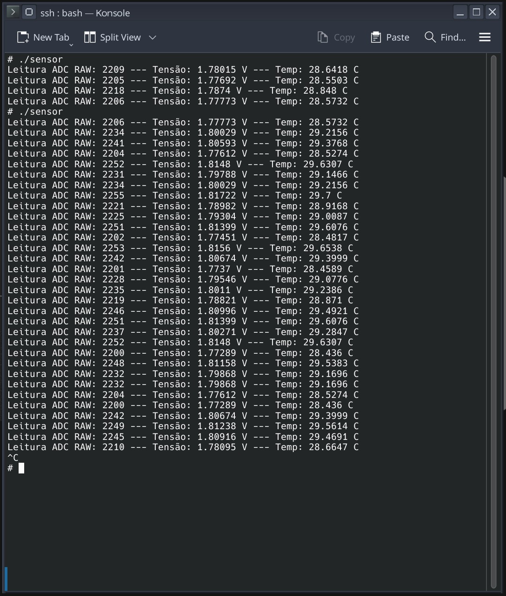

# 🌡️ Leitura de Dados do Sensor - Sensor de Temperatura Analógica

Este repositório contém o código-fonte e a documentação para um projeto de Desenvolvimento Embarcado realizado para a disciplina de **Programação Aplicada**.  
O objetivo principal é demonstrar a comunicação e a leitura de dados de um **sensor de temperatura KY-013** utilizando o kit de desenvolvimento **STM32MP1 DK1**.

---

## 👥 Equipe
- **Mikhael Silveira** – Engenharia Eletrônica  
- **Rafael Sodré** – Engenharia Elétrica  
- **Marcos Vinícius** – Engenharia de Comunicações  

---

## 1. Visão Geral do Projeto
O projeto foca na integração de hardware e software para adquirir dados do ambiente.  
A leitura da temperatura é um exemplo prático que ilustra conceitos-chave como:
- Configuração e uso de periféricos de comunicação.  
- Manipulação de dados em tempo real.  
- Exibição de resultados em um console serial.  

---

## 2. Pré-requisitos

- Kit de desenvolvimento **STM32MP1**;  
- SDK com **toolchain** de compilação cruzada (`arm-buildroot-linux-gnueabihf`);  
- Conexão com o kit via **USB-C** e acesso por **serial (TeraTerm)** ou **rede (SSH)**;  
- Programa `scp` para transferência de arquivos.

---

## 3. Montagem do Hardware
A seguir, a pinagem para a conexão do sensor KY-013 ao kit STM32MP1 DK1.  
**Certifique-se de que a placa está desligada antes de fazer as conexões.**

| Pino do KY-013 | Função            | Pino do STM32MP1 DK1              |
|----------------|------------------|-----------------------------------|
| S              | Sinal Analógico  | `ADC_INx` (substituir `x` pelo ADC utilizado) |
| VCC            | +3.3V            | 3.3V                              |
| GND            | Terra            | GND                               |

⚠️ **Atenção:** verifique sempre o datasheet do kit e do sensor para confirmar a pinagem exata.

---

## 4. Estrutura do Repositório

- build/ # Arquivos gerados pelo processo de compilação
- html/ # Documentação gerada em HTML (via Doxygen)
- latex/ # Documentação gerada em LaTeX/PDF (via Doxygen)
- scr/ # Código-fonte do projeto
- Doxyfile # Arquivo de configuração do Doxygen
- README.md # Documentação principal do projeto

## 5. Instruções de Compilação e Execução

### Compilação
Utilizamos **compilação cruzada** para gerar o binário que será executado no kit **STM32MP1**.  
Primeiro, extraia o SDK: tar -xvf arm-buildroot-linux-gnueabihf_sdk-DK2.tar.gz

- Depois, compile o programa: 

```
cd src/opt/st/stm32mp1/arm-buildroot-linux-gnueabihf_sdk-DK2/bin/arm-linux-gcc -o sensor sensor.c
```

- Envie o binário compilado para o kit via scp:

```
scp -O sensor root@<ip_do_kit>:/home/root/
```

<ip_do_kit> = 192.168.42.2

- No kit de desenvolvimento, torne o binário executável e rode o programa:

```
chmod +x sensor
./sensor
```


## 6. Imagem da Leitura (Entrega 2)


