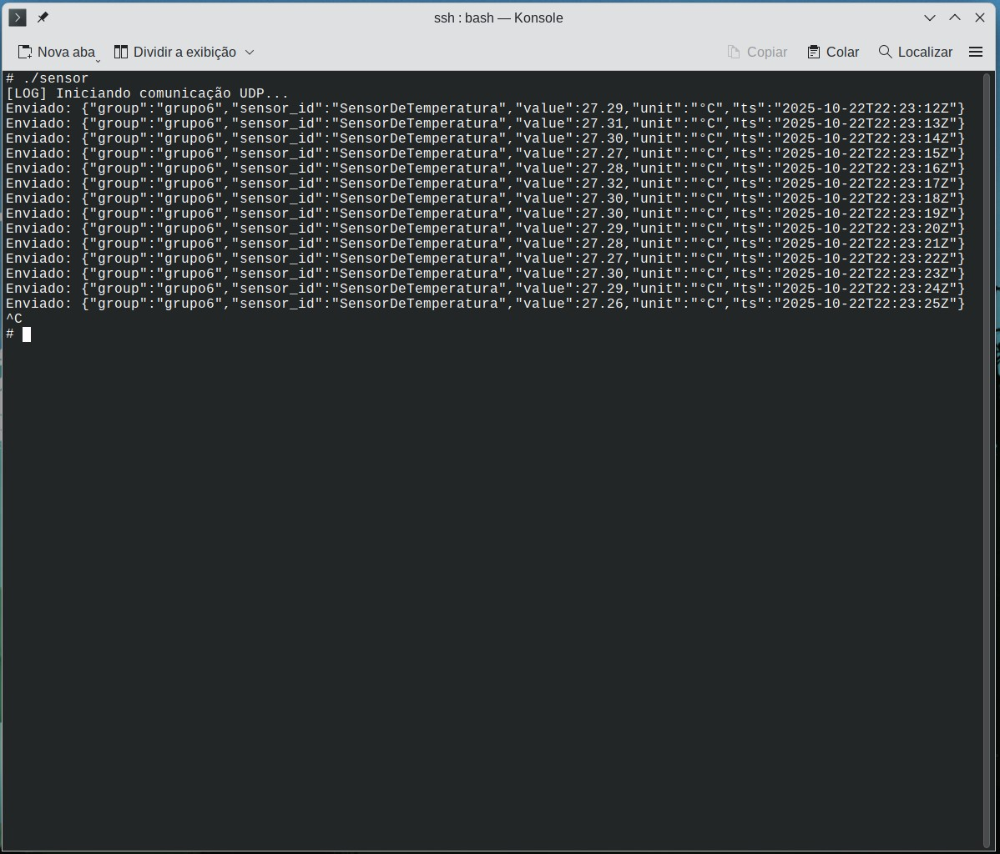

# 🌡️ Leitura de Sensor de Temperatura (KY-013) com STM32MP1


Este repositório contém o código-fonte e a documentação para um projeto de Desenvolvimento Embarcado. O objetivo principal é demonstrar a comunicação e a leitura de dados de um **sensor de temperatura analógico KY-013** utilizando o kit de desenvolvimento **STM32MP1 DK1**.

---

## 👥 Equipe

-   **Mikhael Silveira** – Engenharia Eletrônica
-   **Rafael Sodré** – Engenharia Elétrica
-   **Marcos Vinícius** – Engenharia de Comunicações

---

## 1. Visão Geral do Projeto

O projeto foca na integração de hardware e software para adquirir dados de temperatura do ambiente. Este é um exemplo prático que ilustra conceitos-chave como:

-   Configuração e uso de periféricos (ADC).
-   Manipulação de dados em tempo real.
-   Exibição de resultados em um console serial.

---

## 2. Pré-requisitos

Para compilar e executar este projeto, você precisará de:

-   Kit de desenvolvimento **STM32MP1 DK1**.
-   **SDK de desenvolvimento ST** com a toolchain de compilação cruzada (`arm-buildroot-linux-gnueabihf`).
-   Conexão com o kit via **USB-C** e acesso por **serial (TeraTerm, PuTTY, etc.)** ou **rede (SSH)**.
-   Programa `scp` (ou similar, como WinSCP) para transferência de arquivos.
-   O código-fonte deste repositório. 

### 1. Compilação

Ambiente de compilação cruzada (cross-toolchain) para ARM, como: `arm-linux-gnueabihf-g++`

### 2. Documentação

-   **Doxygen** para gerar documentação técnica.

 ---
## 3. Organização do Código 

O núcleo do projeto é a classe `ADCReader` que abstrai o funcionamento do sensor de temperatura (termistor) e oferece métodos de fácil utilização para ler o valor do ADC, convertê-lo para tensão e calcular a temperatura final.

### Estrutura da Classe

Atributo `adcFilePath`: endereço no sistema Linux embarcado que representa o canal ADC do sensor (ex: `/sys/bus/iio/devices/iio:device0/in_voltage13_raw`).

**Funções principais:**

`int readRawADC()`: Acessa o arquivo de sistema (definido em `adcFilePath`) e lê o valor numérico bruto do ADC.
* Retorna o valor lido (ex: 0-16384) ou -1 em caso de erro.

`double calculateTemperature(int rawADC)`: Recebe o valor bruto do ADC e aplica a equação de Steinhart-Hart (usando os coeficientes definidos na classe) para convertê-lo em temperatura.
* Retorna a temperatura calculada em graus Celsius (°C).

`void startContinuousReading(int intervalSeconds, bool showTemperature)`: Inicia um laço infinito que, a cada `intervalSeconds`, chama `printReading` para exibir os dados de leitura (RAW, Tensão e Temperatura) no terminal.

`int main()`: O código principal instancia a classe `ADCReader` e executa o loop contínuo de leitura através de `startContinuousReading()`.

A cada segundo (por padrão), os valores são exibidos no terminal. O laço pode ser encerrado pelo usuário ao digitar Ctrl+C.

 ---

## 4. Estrutura do Repositório
```
├── 📁 embarcado/                 # Parte 1 - Desenvolvimento embarcado
│   ├── include/                  # Cabeçalhos (.h)
│   │   ├── sensor.hpp            # Classe do sensor
│   │   └── utils.hpp             # Funções auxiliares
│   │   ├── udp_client.hpp
│   │   ├── udp_protocol.hpp      # Estrutura dos pacotes, formatação JSON/CSV
│   │   └── data_formatter.hpp
│   ├── src/                      # Implementações (.cpp)
│   │   ├── sensor.cpp
│   │   └── main_embarcado.cpp    
│   │   ├── udp_client.cpp
│   │   ├── data_formatter.cpp
│   │   └── main.cpp              # Programa principal no kit
│   ├── test/                     # Testes unitários (se aplicável)
│   └── README.md                 # Instruções específicas da parte embarcada
├── 📁 servidor_gui/              # Parte 3 - Interface gráfica
├── 📁 build/      # Arquivos binários gerados pela compilação
├── 📁 html       # Documentação 
├── 📁 latex       # Imagens e screenshots do projeto
│   README.md   # Documentação principal
└── imagem_sensor.jpg
└── imagem_sensor_udp.jpg
```

---

## 5. Montagem do Hardware

A seguir, a pinagem para a conexão do sensor KY-013 ao kit STM32MP1 DK1.

⚠️ **Atenção:** Certifique-se de que a placa esteja **desligada** antes de fazer as conexões.

| Pino do KY-013 | Função | Pino do STM32MP1 DK1 (Header Arduino) |
| :--- | :--- | :--- |
| **S** | Sinal Analógico | `ADC_INx` (Pino Analógico) |
| **VCC** (Meio) | +3.3V | `3.3V` |
| **GND** | Terra | `GND` |

**Nota Importante:** O pino `ADC_INx` é genérico. Você deve verificar no arquivo `src/SensorTemp.cpp` qual pino ADC específico (ex: `A0`, `A1`, etc.) foi configurado no código para conectar o pino de **Sinal (S)** do sensor.

---

## 6. Instruções de Compilação e Execução

O processo utiliza **compilação cruzada** (cross-compilation) para gerar um binário executável para a arquitetura ARM do STM32MP1.

### 6.1. Configuração do Ambiente (Toolchain)

Antes de compilar, você precisa ter o SDK da ST instalado e a toolchain de compilação cruzada acessível em seu terminal.

1.  **Extraia o SDK** (caso ainda não o tenha feito):
    ```bash
    tar -xvf arm-buildroot-linux-gnueabihf_sdk-DK2.tar.gz
    ```

2.  **Adicione a Toolchain ao seu PATH:**
    Adicione o diretório `bin` do SDK ao seu `PATH` de sistema. Isso permite que você chame o compilador `arm-linux-g++` de qualquer lugar.

    ```bash
    # Adicione esta linha ao seu ~/.bashrc ou ~/.zshrc
    export PATH=$PATH:/caminho/completo/para/arm-buildroot-linux-gnueabihf_sdk-DK2/bin
    ```
    *Substitua `/caminho/completo/para/` pelo local onde você extraiu o SDK.*

3.  **Verifique a instalação:**
    Abra um novo terminal e digite:
    ```bash
    arm-linux-g++ --version
    ```
    Se ele mostrar a versão do compilador, você está pronto.

### 6.2. Compilação e Execução

1.  **Clone este repositório** e entre na pasta do projeto.

2.  **Compile o programa:**
    Execute o comando a seguir na raiz do projeto. Ele compilará o `SensorTemp.cpp` e salvará o executável final na pasta `build/`.
    ```bash
    arm-linux-g++ src/SensorTemp.cpp -o build/sensor
    ```

3.  **Envie o binário para a placa:**
    Use `scp` para transferir o arquivo. O IP padrão da placa via conexão USB-C costuma ser `192.168.42.2`.
    ```bash
    # O -O é necessário em versões mais recentes do scp
    scp -O build/sensor root@<ip_do_kit>:/home/root/
    ```

4.  **Execute na Placa:**
    Acesse o terminal da sua placa (via SSH ou serial) e execute os seguintes comandos:
    ```bash
    # Dê permissão de execução ao arquivo
    chmod +x /home/root/sensor

    # Rode o programa
    ./home/root/sensor
    ```

    Você deverá ver as leituras de temperatura aparecendo no console.

---

## 7. Leitura dos dados do sensor pelo terminal serial

A imagem abaixo mostra o programa em execução, exibindo as leituras de temperatura no terminal serial.


---

## 8. Leitura do sensor via UDP

A imagem abaixo mostra o programa em execução, realizando as leituras do ADC, processando e enviando os resultados em um pacote json via UDP.


